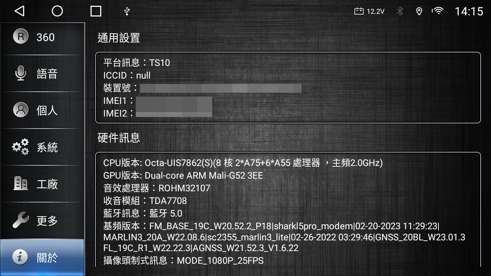

## 前情提要

既然是純紀錄, 就直接用中文寫了

車機是從淘寶買的, 上鏈接~ [點我](https://detail.tmall.com/item.htm?_u=42d7b1eha434&id=637921104328)

買的規格是"9寸7862八核8G+128GB/DSP/Carplay/AUTO/1280屏"

有加360環景的套件

機器用的是方易通(FYT)的主板總成, 市面上大部分的車機應該都是這套解決方案, FYT uis7862s (ums512)

一些開箱照片見此 [點我](./openbox.md)

賣家提供的接線圖 [點我](./installationDiagram.md)

來簡單看一下硬體資訊

原廠用的Apple Carplay, Android Auto是北京至簡的TLink

其實TLink/ZLink都是同一家, 就隨著版本更新一直換名字不知道幹啥

總之APK Package Name: `com.zjinnova.zlink`

目前這版, Android Auto支援有線與無線, Apple Carplay只支援無線

## 參考資料

https://drive.weixin.qq.com/s?k=ABQAQQc3ABA701zp1I#